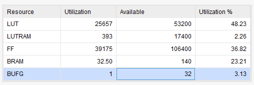

# 軟硬體協同設計 Lab6 —— 加速找臉

*摘要*—這個報告是介紹如何利用上課所學的技術，設計出軟硬體協同的系統來加速「find_face」程式。

*關鍵字*—FPGA、軟硬體協同、Sum of Absolute Difference

## I、簡介   
「find_face」是老師提供的圖形匹配程式。
功能是，在 1920x1080 的照片裡找出 32x32 的臉部圖形，並回傳匹配度。
這個程式在找匹配之前，會對照片用 3x3 median filtering 預處理。
計算匹配度的方法是計算兩張圖形之間的 SAD (Sum of Absolute Difference)，也就是把對應的像素相減之後取絕對值，然後把這些絕對值加總。
SAD 越小，就表示圖形越相似。

「find_face」是純軟體，而且沒有做優化，因此有效能上的問題。
我可以利用 Lab1 所學的方法來尋找效能瓶頸，並嘗試用 ZedBoard 上的資源來加速，接著說明各種方法的效果以及資源使用率。

在 Lab 6 裡，我們會需要從一張照片裡找 4 張臉，因此優化顯得更為重要。

## II、概念
由 Lab 1 的結果 [\[1\]](#f1) 可以得知 `compute_sad` 是原始程式的效能瓶頸，因此優化應該先從 `compute_sad` 開始。
Lab 2 則說明硬體加速時，瓶頸經常會出現在軟體和硬體的溝通。
Lab 3 提出一種減少軟體和硬體溝通成本的方法。
Lab 4 介紹如何用可程式化邏輯來直接存取記憶體 (DMA)。
Lab 5 說明如何實作硬體互斥鎖 (mutex)。

我的優化將會先從軟體開始，再進入硬體加速，途中還會提到各次 Lab 得到的結果。

## III、軟體加速

### A. 我做 Lab1 提出的方法
在 Lab1 時，我把 compute_sad 程式設計成，若加總的過程，超過已找到的最小值，則跳出 compute_sad，以節省計算時間。
我還利用 gcc 編譯器的向量化優化，使程式使用 NEON 指令集，從而加速程式。
我使用的編譯器參數是 `-O3 -mfpu=neon`，`-O3` 表示優化等級，`-mfpu=neon` 表示目標支援 NEON，可以用 NEON 優化。
[\[2\]](#f2)

### B. 自己寫 NEON intrinsics
參考 Arm 的官方文件 [\[3\]](#f3)，以及 gcc 的編譯結果後，我覺得我可以做的比 gcc 的自動向量化更好，所以我就自己寫 NEON intrinsics。
我的程式利用了臉的圖案總是 32x32 的特性，來優化 `compute_sad` 子程序。以下描述我的作法
1. 用 `vld1q` 讀取一列的圖形，由於 `vld1q_u8` 可一次載入 16 個位元組，因此只要 4 次 `vld1q_u8` 就可以載入一列的臉和待比對的圖形。
2. `vabdq_u8` 指令可以一次計算 16 個像素的絕對值差距
3. 計算結果用 `vpadalq_u8` 之類的指令來作加總
 
### C. 結果
以下只是找 1 張臉，我想到找 4 張臉的方法就是一張臉找完再找一張臉，不用重複做 Median filtering，因為是在同一張照片上找。
有 profiling 時，效能也許會變差，所以不再計算子程序的花費時間，以減少 overhead，也不包含讀取圖片的時間，因為那和 SD 卡的儲存方式以及效能有關，導致結果不能重現。

| 方法        | filtering | matching |
| ----------- | ---------:| --------:|
| 原程式      |     918ms |  20251ms |
| 方法A       |     833ms |   2886ms |
| 方法B (-O2) |     979ms |   1767ms |
| 方法B (-O3) |     833ms |   1760ms |
| 方法B (-Os) |    1054ms |   1423ms |

其中必須要講的是，方法 B 並沒有指定優化的等級，所以我測試了幾種等級，結果發現，雖然 `-Os` 為了減少程式大小，會使大部分的程式變慢，但是卻讓 face matching 變快了，是三個測試過的等級裡最快的。

## 四、硬體加速
軟體加速已經到了極致，接著來試試硬體加速。
這裡會把之前的 Lab 拿出來研究，以更了解軟硬體整合後的瓶頸。
由於 Lab 6 需要找 4 張臉，因此以下的測試會搜尋 4 張臉，而不是一張臉。

### A. Lab 2 的設計
因為 `compute_sad` 即使軟體加速後，依然是效能瓶頸，所以就會想把 `compute_sad` 丟給硬體做。
因為可程式化邏輯和處理器使用的記憶體不同，所以需要做資料傳輸。

在這個設計中，硬體的輸入就是照片和臉部圖片各取其中一列的 32 個項素，輸出則是這 32 個像素的 SAD，並使用忙碌等待 (busy loop) 作為軟體和硬體的同步機制。

使用同學提供的臉部圖案後的計算結果

| 臉部圖片  | 匹配時間 |
| --------- | --------:|
| face1.pgm | 169047ms |
| face2.pgm | 141240ms |
| face3.pgm | 162243ms |
| face4.pgm | 103909ms |

怎麼變慢了呢？
用 realtime timer 檢查硬體的花費：

| 臉部圖片  | 傳輸     | 硬體運算 | 匹配時間 |
| --------- | --------:| --------:| --------:|
| face1.pgm | 157720ms |   9250ms | 172857ms |
| face2.pgm | 131751ms |   7726ms | 144418ms |
| face3.pgm | 151368ms |   8877ms | 165902ms |
| face4.pgm |  96886ms |   5681ms | 106236ms |

發現大部分的時間都花在傳輸資料。

### B. 減少軟體和硬體之間的資料傳輸
因為傳輸資料實在太慢，所以必須想辦法減少需要傳輸的資料。
在 Lab 3 裡，老師提到一種方法可以減少傳輸，那就是，重新排列搜尋臉的方向。
如果搜尋臉的方向是由上往下找，則在大多數的時間，兩次連續的搜尋範圍只有一列 32 個像素的差別，因此只需要傳送 32 個像素給硬體。
而且在尋找一張臉的時候，臉的圖案不會變，所以不用每搜尋一個區塊就換一張臉。

在這個設計中，可以把 32x32 區域的圖案包裝成暫存器組 (register bank)，處理器要傳送圖片的時候，只要指定需要更改的列數，傳送 32 個像素，然後再啟動硬體。
我還利用 FPGA 上的 Block RAM，以節省暫存器 (register) 資源。

測量計算所需時間

| 臉部圖片  | 匹配時間 |
| --------- | --------:|
| face1.pgm |  12317ms |
| face2.pgm |  12317ms |
| face3.pgm |  12317ms |
| face4.pgm |  12317ms |

用 realtime timer 檢查硬體的花費：

| 臉部圖片  | 傳輸    | 硬體運算 | 匹配時間 |
| --------- | -------:| --------:| --------:|
| face1.pgm | 10708ms |   1393ms |  12627ms |
| face2.pgm | 10708ms |   1393ms |  12627ms |
| face3.pgm | 10708ms |   1393ms |  12627ms |
| face4.pgm | 10708ms |   1393ms |  12628ms |

### C. 用硬體直接存取記憶體

由於方法 B 還是不夠快，因此我想要把傳輸時間壓到最小。
而傳輸時間最少也是傳輸整張照片一次所需的時間，因為 SAD 最小值可以出現在照片的任何地方。
直覺的方法就是把整張照片存進 FPGA，然而這不可行，因為 ZedBoard 上可供 FPGA 使用的記憶體沒有這麼大。

在 Lab 4，老師教我們如何從硬體直接取得記憶體資料。
這使我想到另一種做法，那就是從硬體直接抓一整列的圖片，如果 FPGA 裝的下 32 列的圖片，就可以用類似硬體設計 B 的方法來計算 SAD 了。
但是我很擔心會用完 FPGA 的資源，為此我特別去查詢規格 [\[4\]](#f4)，才確認可以裝的下。

此外，我也希望可以增加運算單元，但是不知道要安排幾個，因為如果安排太多，有可能記憶體會成為瓶頸，也有可能 FPGA 塞不下。
所以我先測試硬體直接存取記憶體的速度。

將 Lab 4 的程式修改，使的它可以只做記憶體讀取，用它來抓取 1920x1080 的圖片需要約 20 毫秒，而在 100 MHz 的時脈底下，1920x1080 次週期大概也是 20 毫秒，所以一個時脈週期可以計算一次 32x32 圖片的 SAD。

這是我在這份作業採用的硬體設計，下一段會說明架構。

### 五、我用的架構

我的硬體的使用方法類似硬體加速方法 B，只要先輸入臉的圖像，就可以由上而下的掃描照片，不過可以一次掃描一整列 1920 個像素，而不是只有 32 個像素。

如果硬體儲存了圖片的連續 32 列，例如 i 到 i+31，則硬體可以計算 y 座標是i的SAD。
這時候會發現，連續兩次的計算範圍只相差一個直行。
這一行資料可以用 BRAM來輸出。
做法是，每一列有一個BRAM，讀取下一行的時候就把每個 BRAM的讀取位置都設成行數。

向主記憶體接收像素的時候，則是只把代表那一列的BRAM的寫入打開。

### A. 計算 SAD 的流水線

BRAM 的行輸出 => 旋轉圖片 => 32x32 的shift register => Absolute Difference => 加法樹

要旋轉圖片是因為，為了減少記憶體的搬運次數，2~33 列的圖片會被存成 (32, 33, 2, 3, 4, 5, …, 32)，但是臉部圖案沒有跟著移動，會對應到錯誤的像素。
所以透過旋轉圖片的模組，將以上的內容轉成 2~33。

### B. 介面

#### *1) hw_active：* 用來啟動硬體，以及檢查運算是否完成
#### *2) feature：* 設定功能，可以是 1 或 3。
1 是讀取臉的圖案，3 是讀取下一列照片並計算 SAD 的最小值
#### *3) copy_len：* 設定照片的寬度
#### *4) src_addr：* 設定照片的下一列的位址，或者設定臉的位址
#### *5) dst_row：* 設定目前掃描的列
#### *6) min_sad：* 硬體輸出這一列 SAD 的最小值
#### *7) min_sad_pos：* 硬體輸出 SAD 最小值出現的x座標

### C. 方塊圖
TODO

### D. 狀態圖
TODO

#### *1) Idle*
在沒有事情的時候會在這個狀態，當硬體被啟動後則進入 Try_read
#### *2) Try_read*
檢查是否要讀取記憶體，因為目前支援的功能都要讀取記憶體，所以總是進到 Init_Read
#### *3) Init_read*
在這個狀態初始化 AXI Master，使其讀取圖像
#### *4) Reading*
等待 AXI Master 讀取一列的圖像
#### *5) Try_compute*
如果要計算 SAD 的最小值，則進入 Init_compute，否則從第 0 個 row buffer 載入臉的圖案
#### *6) Init_compute*
初始化 pipe_sad 流水線模組
#### *7) Compute*
在這個狀態會不斷的把下一行的照片傳給流水線，直到照片的右邊緣，才進入 Finish_compute
#### *8) Finish_compute*
等待流水線完成，再進入 Done
#### *9) Done*
運算完成，請求 AXI slave 把 hw_active 拉回 0
#### *10) Done2*
用來等待 AXI Slave 把 hw_active 拉回到 0

### E. 效率

| 臉部圖片  | 匹配時間 |
| --------- | --------:|
| face1.pgm |     40ms |
| face2.pgm |     40ms |
| face3.pgm |     40ms |
| face4.pgm |     40ms |

我沒有像學長做的一樣好 [\[5\]](#f5)，因為我的硬體必須先完成讀取記憶體，才開始計算。
不過據 DEMO 的助教所言，這已經夠快了。

我的設計是純硬體計算，因為我覺得再加上軟體也沒有顯著的差異，並不值得我實作。

## VI. 資源使用率

另外，Worst negative slack 是 1.436ns。

## 感想
因為聽說這門課以後不會再開，所以我不希望作業做得太爛。
可惜我還是無法達成自己的目標，因為期末期間有好多個報告。
我有想過，如果人臉圖片的大小不是 32x32 要怎麼處理，但是我其實也做不出來。

我做 Lab 6 的第一步是製作陣列加法器，用來測試 DMA 到底有多快，結果就因為違反 AMBA AXI 的規格 [\[6\]](#f6)，而造成快取故障。
這個問題花了我快一個禮拜才解決。

還有，我有寫記憶體的 testbench，想要用 `$fopen` 來載入圖片，卻一直碰到「無法開啟檔案」的錯誤，導致我無法模擬我寫的 Verilog 程式。
我不敢說我的程式對不對。

## 參考資料

[1] 陳羿豐，「軟硬體協同設計 Lab 1 報告」。
2018。

[2] Richard M. Stallman et al., "Using the GNU Compiler Collection".
 Free Software Foundation, Boston.
https://gcc.gnu.org/onlinedocs/gcc-5.5.0/gcc/.
擷取日期：2018/06/28

[3] ARM Informaion Center, "ARM Compiler toolchain Compiler Reference".
Arm Limited. 1995-2018.
http://infocenter.arm.com/help/index.jsp?topic=/com.arm.doc.dui0491f/BABEDJFB.html.
擷取日期：2018/06/27

[4] Xilinx, Inc., "Zynq-7000 All Programmable SoC Data Sheet".
2017.
https://www.xilinx.com/support/documentation/data_sheets/ds190-Zynq-7000-Overview.pdf.
擷取日期：2018/06/29

[5]	Chih-Yung Liang, “Hardware-Software Co-Design for Accelerating “Find Face””. https://github.com/nctu-homeworks/shlab-final. 擷取日期：2018/06/29

[6]	ARM Limited., AMBA AXI Protocol Specification.2003-2004. 第4.1章

